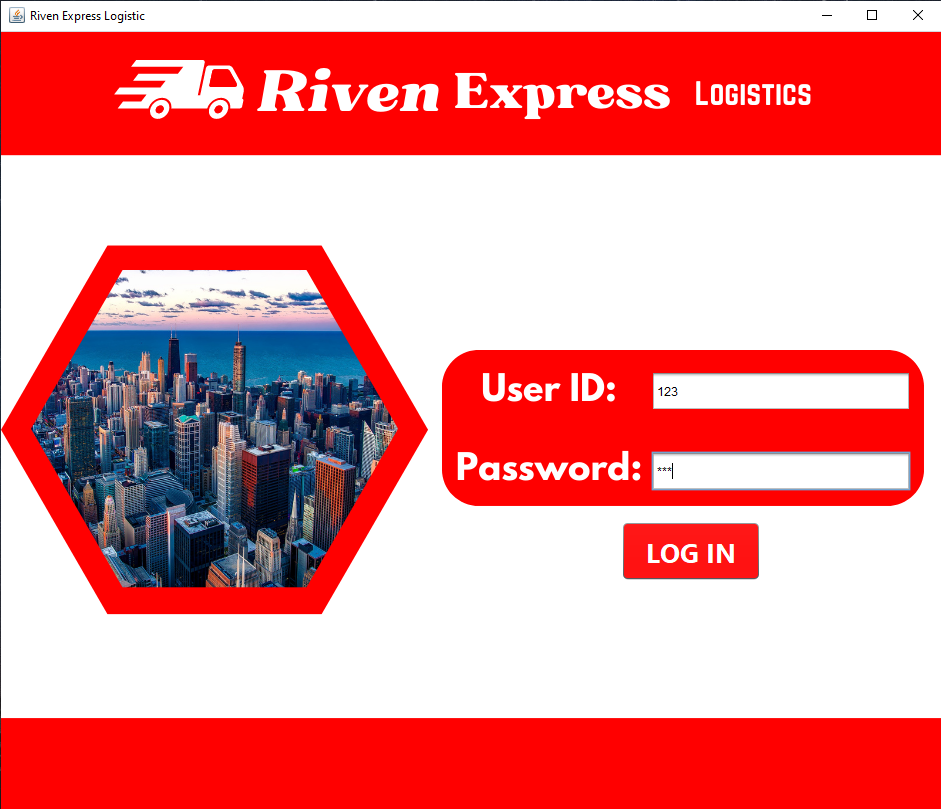
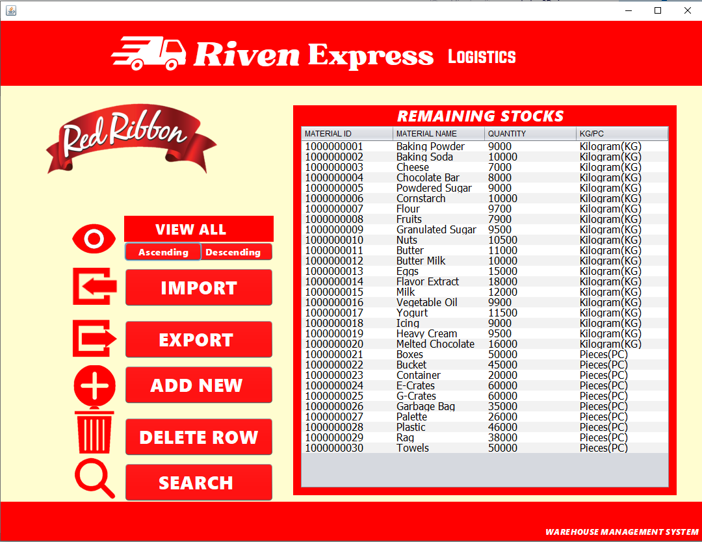
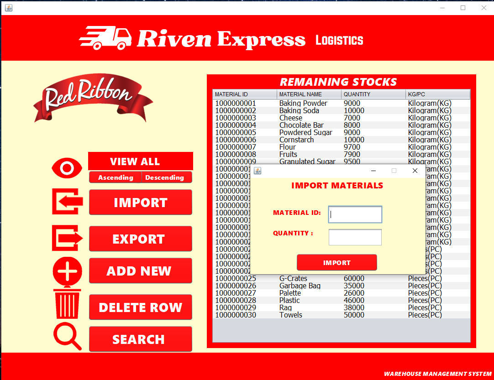
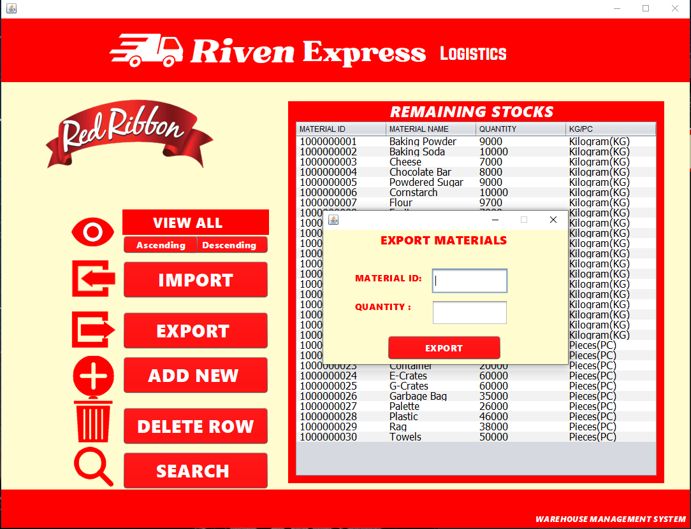
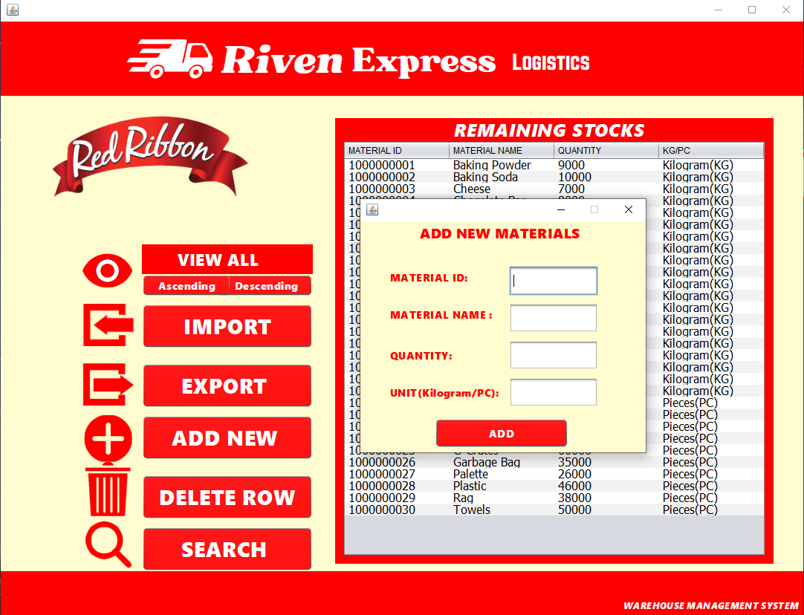
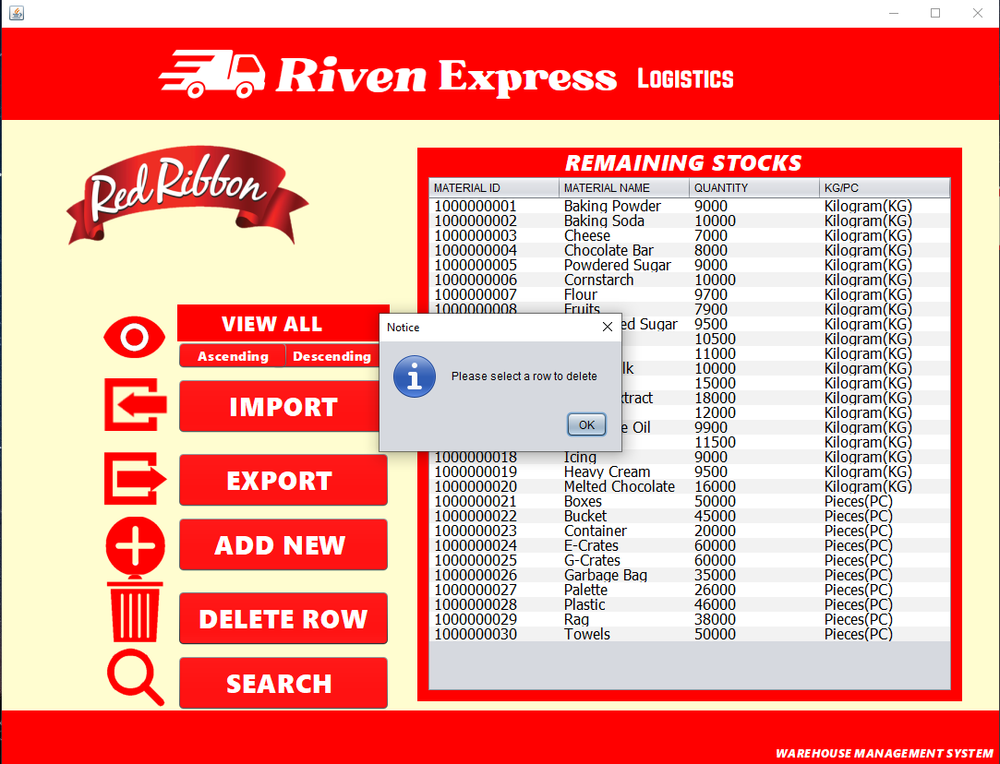
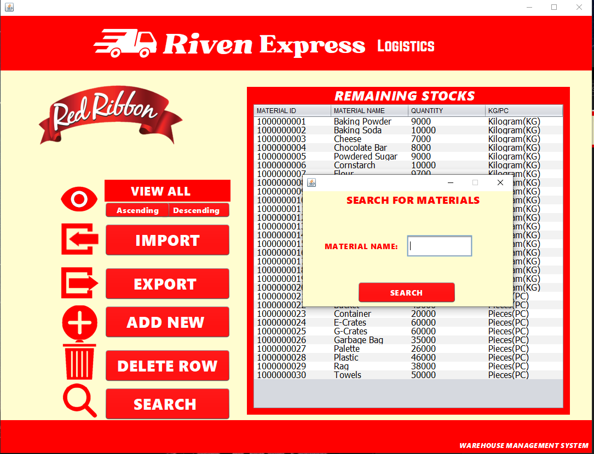

## Inventory System

Used Java Netbeans 17

1st year college project in java, using arraylist to store the stocks.

Warehouse Management( Inventory System ) 
We manage the remaining stocks of raw materials ,used CRUD (create,read,update,delete) operations, no database

# Overview

